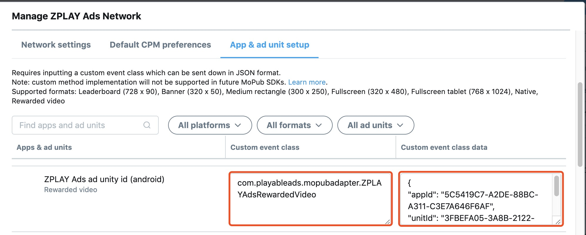

# 目录

- [目录](#%E7%9B%AE%E5%BD%95)
  - [1. 在可玩广告平台申请应用ID及广告位ID](#1-%E5%9C%A8%E5%8F%AF%E7%8E%A9%E5%B9%BF%E5%91%8A%E5%B9%B3%E5%8F%B0%E7%94%B3%E8%AF%B7%E5%BA%94%E7%94%A8id%E5%8F%8A%E5%B9%BF%E5%91%8A%E4%BD%8Did)
    - [1.1 进入“应用管理”页面，点击添加“添加应用”按钮](#11-%E8%BF%9B%E5%85%A5%E5%BA%94%E7%94%A8%E7%AE%A1%E7%90%86%E9%A1%B5%E9%9D%A2%E7%82%B9%E5%87%BB%E6%B7%BB%E5%8A%A0%E6%B7%BB%E5%8A%A0%E5%BA%94%E7%94%A8%E6%8C%89%E9%92%AE)
    - [1.2 填写相关信息，点击“保存”按钮，返回应用管理列表页](#12-%E5%A1%AB%E5%86%99%E7%9B%B8%E5%85%B3%E4%BF%A1%E6%81%AF%E7%82%B9%E5%87%BB%E4%BF%9D%E5%AD%98%E6%8C%89%E9%92%AE%E8%BF%94%E5%9B%9E%E5%BA%94%E7%94%A8%E7%AE%A1%E7%90%86%E5%88%97%E8%A1%A8%E9%A1%B5)
    - [1.3 在应用管理列表页，获取应用的ID](#13-%E5%9C%A8%E5%BA%94%E7%94%A8%E7%AE%A1%E7%90%86%E5%88%97%E8%A1%A8%E9%A1%B5%E8%8E%B7%E5%8F%96%E5%BA%94%E7%94%A8%E7%9A%84id)
    - [1.4 点击应用右侧的“创建广告位”按钮或者进入“广告位管理页面”点击“添加广告位”按钮](#14-%E7%82%B9%E5%87%BB%E5%BA%94%E7%94%A8%E5%8F%B3%E4%BE%A7%E7%9A%84%E5%88%9B%E5%BB%BA%E5%B9%BF%E5%91%8A%E4%BD%8D%E6%8C%89%E9%92%AE%E6%88%96%E8%80%85%E8%BF%9B%E5%85%A5%E5%B9%BF%E5%91%8A%E4%BD%8D%E7%AE%A1%E7%90%86%E9%A1%B5%E9%9D%A2%E7%82%B9%E5%87%BB%E6%B7%BB%E5%8A%A0%E5%B9%BF%E5%91%8A%E4%BD%8D%E6%8C%89%E9%92%AE)
    - [1.5填写相关信息，点击“保存”按钮，返回广告位管理列表页](#15%E5%A1%AB%E5%86%99%E7%9B%B8%E5%85%B3%E4%BF%A1%E6%81%AF%E7%82%B9%E5%87%BB%E4%BF%9D%E5%AD%98%E6%8C%89%E9%92%AE%E8%BF%94%E5%9B%9E%E5%B9%BF%E5%91%8A%E4%BD%8D%E7%AE%A1%E7%90%86%E5%88%97%E8%A1%A8%E9%A1%B5)
    - [1.6在广告位管理列表页，获取广告位的ID](#16%E5%9C%A8%E5%B9%BF%E5%91%8A%E4%BD%8D%E7%AE%A1%E7%90%86%E5%88%97%E8%A1%A8%E9%A1%B5%E8%8E%B7%E5%8F%96%E5%B9%BF%E5%91%8A%E4%BD%8D%E7%9A%84id)
  - [2. 添加MoPub SDK和ZPLAY Ads SDK，步骤如下：](#2-%E6%B7%BB%E5%8A%A0mopub-sdk%E5%92%8Czplay-ads-sdk%E6%AD%A5%E9%AA%A4%E5%A6%82%E4%B8%8B)
    - [2.1 添加Android工程依赖](#21-%E6%B7%BB%E5%8A%A0android%E5%B7%A5%E7%A8%8B%E4%BE%9D%E8%B5%96)
    - [2.2 在Manifest文件下添加MoPub使用到的组件](#22-%E5%9C%A8manifest%E6%96%87%E4%BB%B6%E4%B8%8B%E6%B7%BB%E5%8A%A0mopub%E4%BD%BF%E7%94%A8%E5%88%B0%E7%9A%84%E7%BB%84%E4%BB%B6)
  - [3. 添加适配器文件](#3-%E6%B7%BB%E5%8A%A0%E9%80%82%E9%85%8D%E5%99%A8%E6%96%87%E4%BB%B6)
  - [4. 在MoPub平台为可玩广告配置广告位](#4-%E5%9C%A8mopub%E5%B9%B3%E5%8F%B0%E4%B8%BA%E5%8F%AF%E7%8E%A9%E5%B9%BF%E5%91%8A%E9%85%8D%E7%BD%AE%E5%B9%BF%E5%91%8A%E4%BD%8D)
    - [4.1 为可玩广告新建广告位](#41-%E4%B8%BA%E5%8F%AF%E7%8E%A9%E5%B9%BF%E5%91%8A%E6%96%B0%E5%BB%BA%E5%B9%BF%E5%91%8A%E4%BD%8D)
    - [4.2 获取已有广告位的ID](#42-%E8%8E%B7%E5%8F%96%E5%B7%B2%E6%9C%89%E5%B9%BF%E5%91%8A%E4%BD%8D%E7%9A%84id)
  - [5. 在MoPub平台增加可玩广告为新的广告源](#5-%E5%9C%A8mopub%E5%B9%B3%E5%8F%B0%E5%A2%9E%E5%8A%A0%E5%8F%AF%E7%8E%A9%E5%B9%BF%E5%91%8A%E4%B8%BA%E6%96%B0%E7%9A%84%E5%B9%BF%E5%91%8A%E6%BA%90)
    - [5.1 进入“Networks”页面，点击“New network”按钮](#51-%E8%BF%9B%E5%85%A5networks%E9%A1%B5%E9%9D%A2%E7%82%B9%E5%87%BBnew-network%E6%8C%89%E9%92%AE)
    - [5.2 点击“Custom SDK network“链接](#52-%E7%82%B9%E5%87%BBcustom-sdk-network%E9%93%BE%E6%8E%A5)
    - [5.3 添加可玩广告平台名称为ZPLAY Ads Network，并且在步骤3中申请的广告位中配置可玩广告（图示1和图示2）](#53-%E6%B7%BB%E5%8A%A0%E5%8F%AF%E7%8E%A9%E5%B9%BF%E5%91%8A%E5%B9%B3%E5%8F%B0%E5%90%8D%E7%A7%B0%E4%B8%BAzplay-ads-network%E5%B9%B6%E4%B8%94%E5%9C%A8%E6%AD%A5%E9%AA%A43%E4%B8%AD%E7%94%B3%E8%AF%B7%E7%9A%84%E5%B9%BF%E5%91%8A%E4%BD%8D%E4%B8%AD%E9%85%8D%E7%BD%AE%E5%8F%AF%E7%8E%A9%E5%B9%BF%E5%91%8A%E5%9B%BE%E7%A4%BA1%E5%92%8C%E5%9B%BE%E7%A4%BA2)
  - [6. 在MoPub平台打开可玩广告广告源](#6-%E5%9C%A8mopub%E5%B9%B3%E5%8F%B0%E6%89%93%E5%BC%80%E5%8F%AF%E7%8E%A9%E5%B9%BF%E5%91%8A%E5%B9%BF%E5%91%8A%E6%BA%90)
    - [6.1 进入“segments”页面，点击“Global Segment”链接](#61-%E8%BF%9B%E5%85%A5segments%E9%A1%B5%E9%9D%A2%E7%82%B9%E5%87%BBglobal-segment%E9%93%BE%E6%8E%A5)
    - [6.2 找到接入可玩广告的应用（如示例中MediationMopub）及广告位（示例中的新可玩广告），打开可玩广告广告源（图中的turn on所示的按钮）](#62-%E6%89%BE%E5%88%B0%E6%8E%A5%E5%85%A5%E5%8F%AF%E7%8E%A9%E5%B9%BF%E5%91%8A%E7%9A%84%E5%BA%94%E7%94%A8%E5%A6%82%E7%A4%BA%E4%BE%8B%E4%B8%ADmediationmopub%E5%8F%8A%E5%B9%BF%E5%91%8A%E4%BD%8D%E7%A4%BA%E4%BE%8B%E4%B8%AD%E7%9A%84%E6%96%B0%E5%8F%AF%E7%8E%A9%E5%B9%BF%E5%91%8A%E6%89%93%E5%BC%80%E5%8F%AF%E7%8E%A9%E5%B9%BF%E5%91%8A%E5%B9%BF%E5%91%8A%E6%BA%90%E5%9B%BE%E4%B8%AD%E7%9A%84turn-on%E6%89%80%E7%A4%BA%E7%9A%84%E6%8C%89%E9%92%AE)
  - [7. 确认可玩广告配置成功](#7-%E7%A1%AE%E8%AE%A4%E5%8F%AF%E7%8E%A9%E5%B9%BF%E5%91%8A%E9%85%8D%E7%BD%AE%E6%88%90%E5%8A%9F)
  - [8. 在工程中使用MoPub请求可玩广告](#8-%E5%9C%A8%E5%B7%A5%E7%A8%8B%E4%B8%AD%E4%BD%BF%E7%94%A8mopub%E8%AF%B7%E6%B1%82%E5%8F%AF%E7%8E%A9%E5%B9%BF%E5%91%8A)
  - [9. 测试](#9-%E6%B5%8B%E8%AF%95)


## 1. 在可玩广告平台申请应用ID及广告位ID

### 1.1 进入“[应用管理](https://sellers.zplayads.com/#/app/appList/)”页面，点击添加“添加应用”按钮


### 1.2 填写相关信息，点击“保存”按钮，返回应用管理列表页

a. 若您的应用已上线，且为Google Play渠道的应用，可直接填入应用包名获取应用信息


b. 若您未在Google Play上线，或发布在非Google Play渠道，您需手动填写应用信息


### 1.3 在应用管理列表页，获取应用的ID


### 1.4 点击应用右侧的“创建广告位”按钮或者进入“[广告位管理页面](https://sellers.zplayads.com/#/ad/placeList/)”点击“添加广告位”按钮


### 1.5填写相关信息，点击“保存”按钮，返回广告位管理列表页


### 1.6在广告位管理列表页，获取广告位的ID


注：您在测试中可使用如下id进行测试，测试id不会产生收益，应用上线时请使用您申请的正式id。

|广告形式|  App_ID  |  Ad_Unit_id|
|---|----------|------------|
|激励视频|5C5419C7-A2DE-88BC-A311-C3E7A646F6AF|3FBEFA05-3A8B-2122-24C7-A87D0BC9FEEC|
|插屏广告|5C5419C7-A2DE-88BC-A311-C3E7A646F6AF|19393189-C4EB-3886-60B9-13B39407064E|

## 2. 添加MoPub SDK和ZPLAY Ads SDK，步骤如下：

```java
dependencies {
    ...
    // 可玩广告依赖
    implementation 'com.playableads:playableads:2.4.1'
    // mopub广告依赖
    implementation('com.mopub:mopub-sdk:5.6.0@aar') {
        transitive = true
    }
}
```

### 2.1 添加Android工程依赖

### 2.2 在Manifest文件下添加MoPub使用到的组件

```java
<application>
    <activity
        android:name="com.mopub.mobileads.MoPubActivity"
        android:configChanges="keyboardHidden|orientation|screenSize" />
    <activity
        android:name="com.mopub.mobileads.MraidActivity"
        android:configChanges="keyboardHidden|orientation|screenSize" />
    <activity
        android:name="com.mopub.common.MoPubBrowser"
        android:configChanges="keyboardHidden|orientation|screenSize" />
    <activity
        android:name="com.mopub.mobileads.MraidVideoPlayerActivity"
        android:configChanges="keyboardHidden|orientation|screenSize" />
    <activity
        android:name="com.mopub.mobileads.RewardedMraidActivity"
        android:configChanges="keyboardHidden|orientation|screenSize" />
</application>
```

## 3. 添加适配器文件
1. 激励视频适配器及位置：[ZPLAYAdsRewardedVideo.java](./app/src/main/java/com/zplay/playable/mediationmopub/ZPLAYAdsRewardedVideo.java)

2. 插屏适配器及位置：[MPZPLAYAdsInterstitial.java](./app/src/main/java/com/zplay/playable/mediationmopub/MPZPLAYAdsInterstitial.java)

确保导入相关的类之后没有错误提示，记录该文件包路径，例如：（com.zplay.playable.mediationmopub.ZPLAYAdsRewardedVideo），这个路径用于在MoPub平台配置ZPLAYAds信息。

文档整体以激励视频为例，插屏配置过程与激励视频相似。

## 4. 在[MoPub平台](https://app.mopub.com/apps)为可玩广告配置广告位

### 4.1 为可玩广告新建广告位

- a. 进入应用，点击“New ad unit”按钮


- b. 创建广告位，请注意Format应该为Rewarded video或Fullscreen，点击“save”按钮，此处以Rewarded video为例

 

- c. 获取新创建广告位的ad unit ID


### 4.2 获取已有广告位的ID

- a. 选择应用，进入广告位列表，选择要接入的广告位，点击进入。点击“Edit ad unit”按钮，点击“view code integration”按钮


- b. 获取广告位的ad unit ID


## 5. 在[MoPub平台](https://app.mopub.com/networks)增加可玩广告为新的广告源

### 5.1 进入“Networks”页面，点击“New network”按钮


### 5.2 点击“Custom SDK network“链接


### 5.3 添加可玩广告平台名称为ZPLAY Ads Network，并且在步骤3中申请的广告位中配置可玩广告（图示1和图示2）




- a. 请在图示1的位置添加如下信息：

```java
com.zplay.playable.mediationmopub.ZPLAYAdsRewardedVideo
```
若您要配置插屏广告位，请使用如下信息：
```java
com.zplay.playable.mediationmopub.MPZPLAYAdsInterstitial
```

注：(填写的是ZPLAYAdsRewardedVideo在项目中实际的位置)
```
{
    "APPID": "5C5419C7-A2DE-88BC-A311-C3E7A646F6AF",
    "AdUnitId": "3FBEFA05-3A8B-2122-24C7-A87D0BC9FEEC"
}
```

- b. 请在图示2的位置添加在可玩广告平台申请的广告位信息

注意：将5C5419C7-A2DE-88BC-A311-C3E7A646F6AF替换成您在可玩广告平台申请的APPID（步骤1.3），将3FBEFA05-3A8B-2122-24C7-A87D0BC9FEEC替换成您在可玩广告平台申请的AdUnitId（步骤1.6）。

## 6. 在[MoPub平台](https://app.mopub.com/segments)打开可玩广告广告源

### 6.1 进入“segments”页面，点击“Global Segment”链接


### 6.2 找到接入可玩广告的应用（如示例中MediationMopub）及广告位（示例中的新可玩广告），打开可玩广告广告源（图中的turn on所示的按钮）


## 7. 确认可玩广告配置成功

进入6.2 中已经打开可玩广告源的广告位管理页面，如果成功配置，则会在ad sources列表中会显示如下信息。如果未显示，请参照以上步骤进行检查。


## 8. 在工程中使用MoPub请求可玩广告

详情参考Demo示例，示例中各文件作用如下：

[MainActivity](./app/src/main/java/com/zplay/playable/mediationmopub/MainActivity.java)中有mopub初始化设置，可以参考[mopub文档](https://developers.mopub.com/docs/android/initialization/)进行设置

[RewardedVideoActivity](./app/src/main/java/com/zplay/playable/mediationmopub/RewardedVideoActivity.java)是激励视频示例，在文件中填写在mopub平台上申请的激励视频广告位id，并配置好[可玩视频适配器](./app/src/main/java/com/zplay/playable/mediationmopub/ZPLAYAdsRewardedVideo.java)，就可以通过mopub获取到ZPLAYAds激励视频广告。

[InterstitialActivity](./app/src/main/java/com/zplay/playable/mediationmopub/InterstitialActivity.java)是插屏广告示例，在文件中填写在mopub平台申请的插屏广告位id，并配置好[可玩插屏适配器](./app/src/main/java/com/zplay/playable/mediationmopub/MPZPLAYAdsInterstitial.java)，就可以通过mopub获取到ZPLAYAds插屏广告。

## 9. 测试
您在测试中可使用如下ID进行测试，测试ID不会产生收益，应用上线时请使用您申请的正式ID。

|广告形式|  App_ID  |  Ad_Unit_ID|
|---|----------|------------|
|激励视频|5C5419C7-A2DE-88BC-A311-C3E7A646F6AF|3FBEFA05-3A8B-2122-24C7-A87D0BC9FEEC|
|插屏广告|5C5419C7-A2DE-88BC-A311-C3E7A646F6AF|19393189-C4EB-3886-60B9-13B39407064E|
